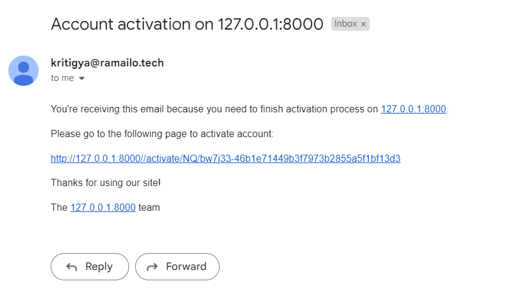
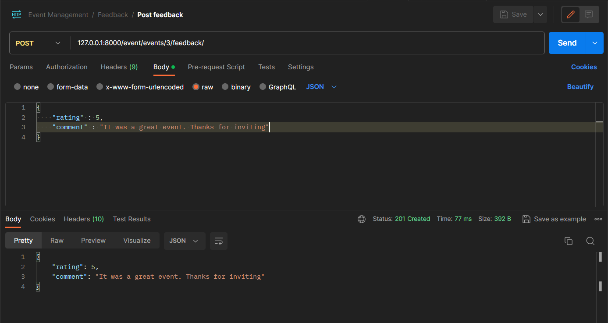
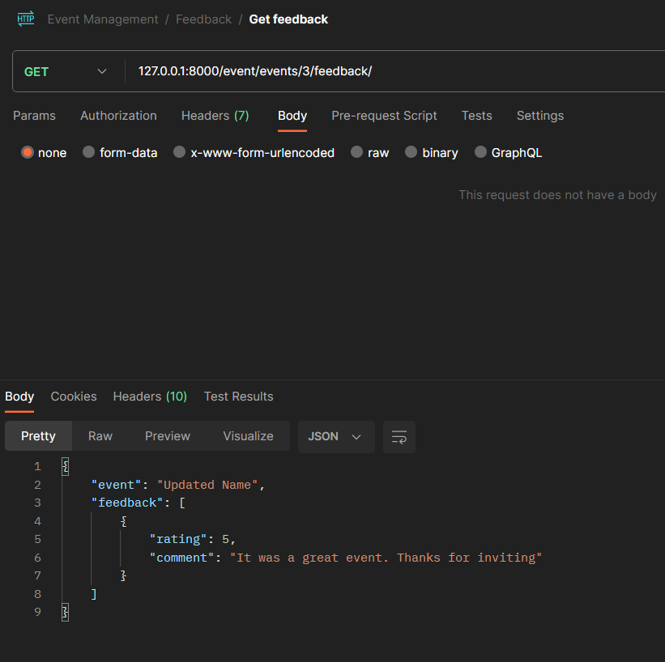
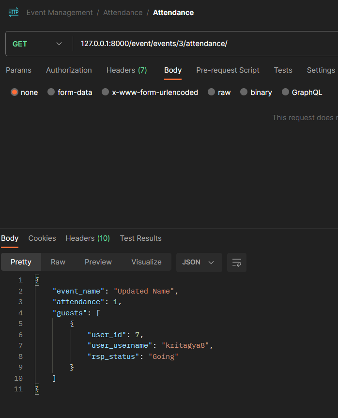
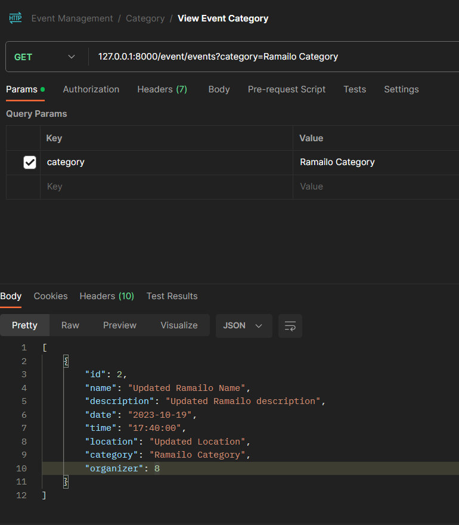
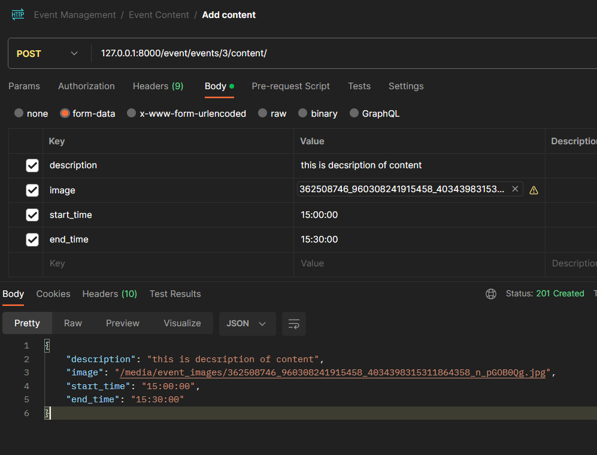
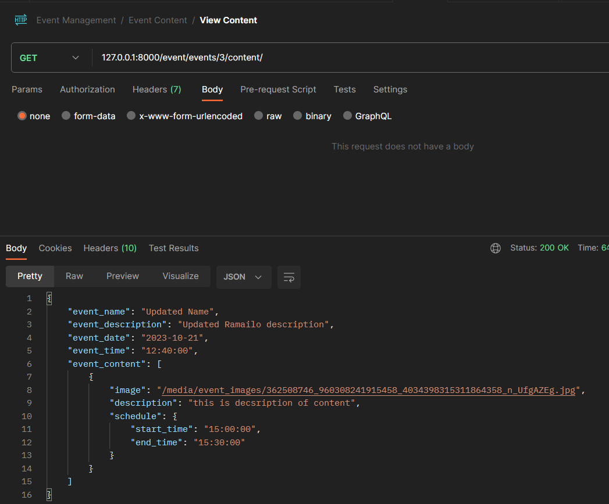
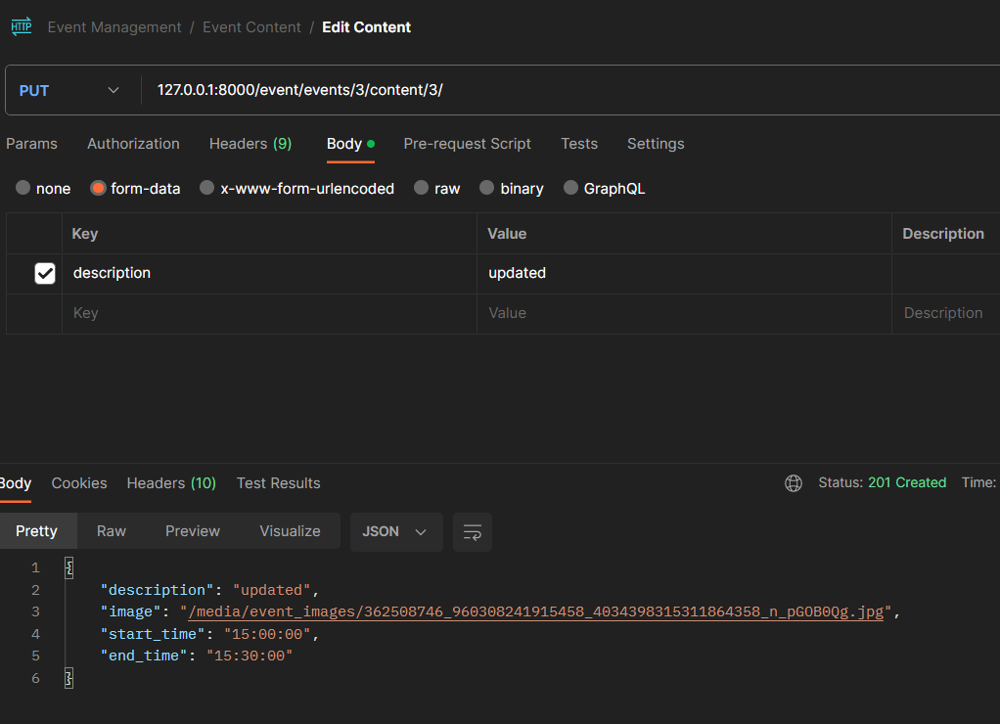
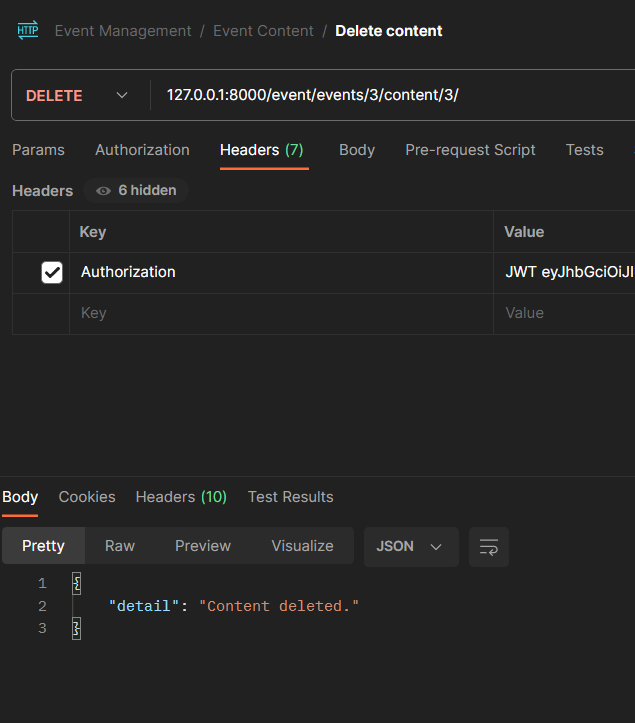
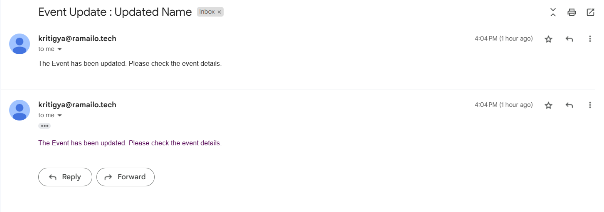

<h1>Online Event Management System</h1>
<h2>Description:</h2>

Users can register, create, manage, and attend events. Additionally, they can RSVP, view event details, provide feedback. Event organizers can track attendance and manage event-related content.

<h3>The API Documentaion can be viewed here: <a href="https://documenter.getpostman.com/view/20090644/2s9YR9Zt8t">Docs</a></h3>

<h2>Operations:</h2>
<h3>User Registration:</h3>

Users can register to the event management system.

<a href="https://djoser.readthedocs.io/en/latest/introduction.html">Djoser</a> is used for the user registration.

<h4>Register</h4>

<h4>Activation Email</h4>

<h4>Login</h4>

<h3>Event Creation:</h3>

Users can create and manage events.

<h4>Create Event</h4>

Only auhtenticated users can create event so we pass the jwt token in the headers.

<h4>View all Event</h4>

<h4>Edit Event</h4>

Only the organizer can modify the event.

<h3>RSVP:</h3>
<h4>Joing Event:</h4>

<h4>Event Details:</h4>

<h3>Feedback:</h3>
<h4>Posting Feedback</h4>

<h4>Viewing Feedback</h4>

<h3>Attendance</h3>
<h4>Viewing attendance</h4>

<h3>Category</h3>
<h4>Filter using category</h4>

<h3>Event Content</h3>
<h4>Add Content</h4>

<h4>View Content</h4>

<h4>Edit Content</h4>

<h4>Delete Content</h4>

<h3>Reminder day before the event:</h3>

<h3>Event updates if there is any change in the eent.</h3>
